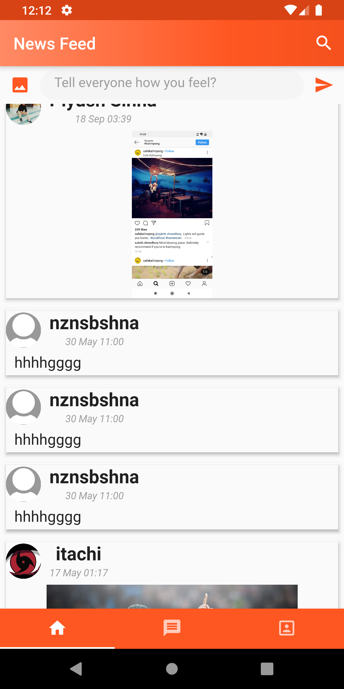
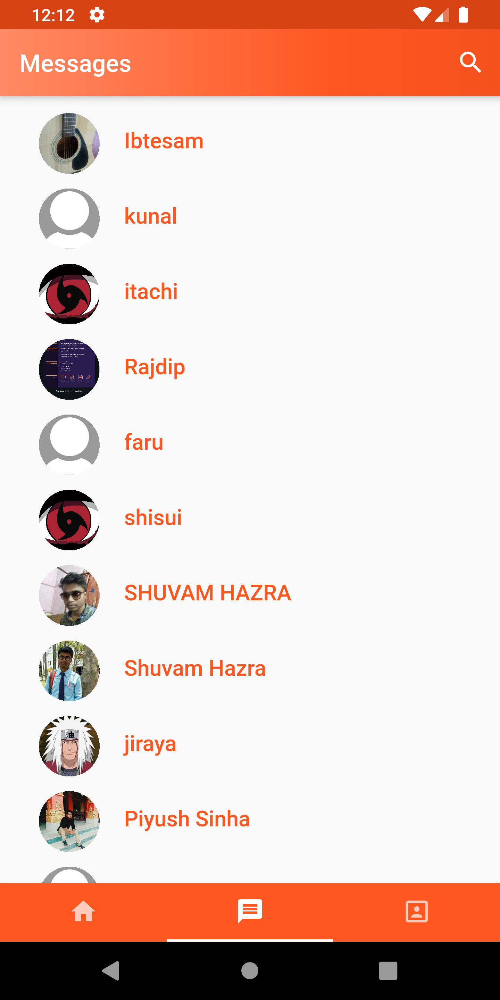
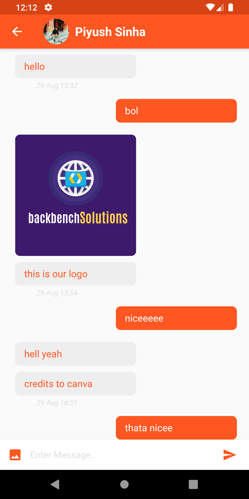
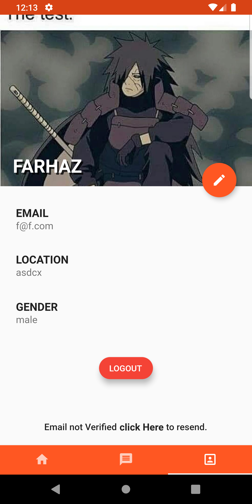
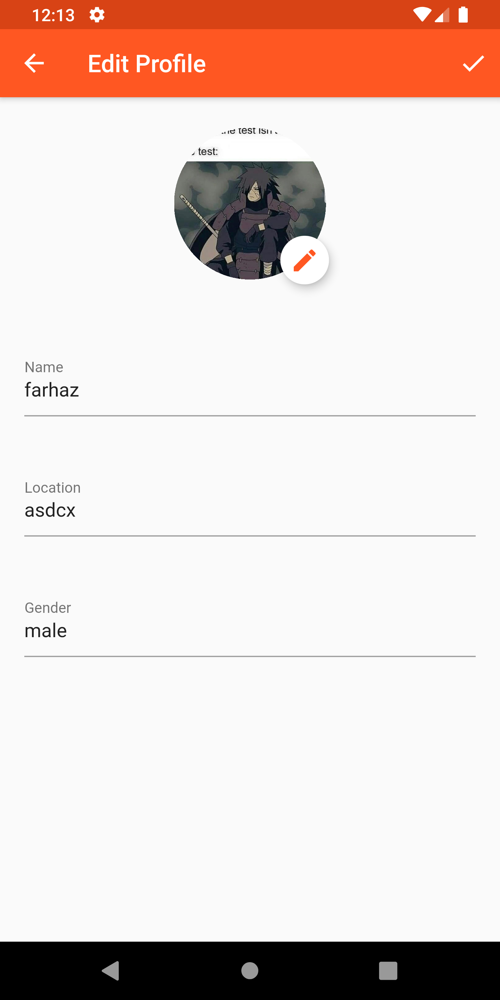

# Handshake

Handshake is a Social Media App made using Flutter.

## Note
This app is still under development and I will try my best to add new features.

## Features!

  - News Feed
  - Fully Functioning Chat page
  - Notification on new chat recieve
  - profile page

## Screenshots
             